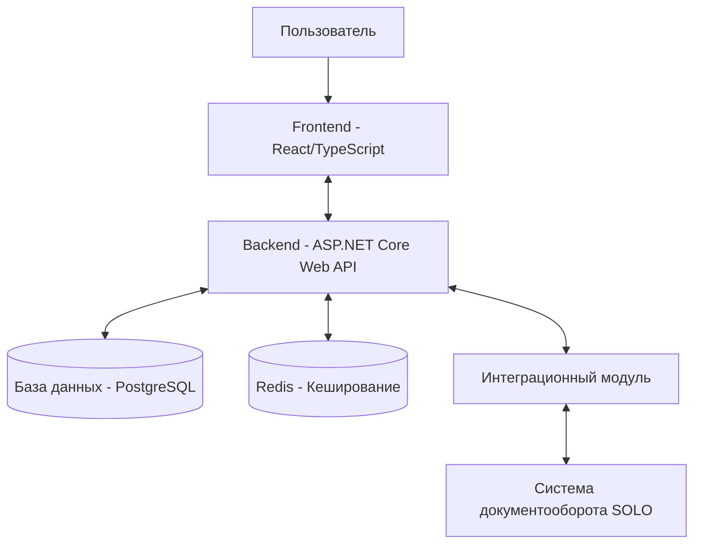

# Etude - автоматизированная система организации записи на внешнее обучение

**Etude** - это веб-приложение, разработанное для автоматизации процесса организации записи сотрудников компаний ООО «УЦСБ» и UDV Group на внешнее обучение. Система предназначена для упрощения и повышения эффективности всего жизненного цикла заявлений на обучение: от создания заявки до получения обратной связи после прохождения мероприятия.

### Назначение системы

Система предназначена для автоматизации организации записи сотрудников на внешнее обучение с обеспечением следующей функциональности:
- Управление заявками на обучение: создание, редактирование, подтверждение
- Мониторинг распределения сотрудников по запланированным, текущим и прошедшим мероприятиям
- Формирование и экспорт данных по затратам и мероприятиям
- Интеграция с системой документооборота SOLO для отправки и получения данных

### Цели создания системы

Основной целью разработки и внедрения системы является повышение качества и эффективности процесса обработки заявлений на внешнее обучение за счет:
- Автоматизации процесса обработки заявок на обучение
- Сокращения сроков рассмотрения заявок на обучение
- Повышения прозрачности процесса согласования заявок на обучение

### Целевая аудитория

Система предназначена для специалистов по организации внешнего обучения и сотрудников департаментов компаний УЦСБ и UDV Group.

### Демо-стенд

http://109.73.203.57

Данные для входа

Администратор(Специалист по внешнему обучению)
```
ustin.tretyakov@techprogress.com:test
```
Пользователь
```
:test
```
# Функциональные возможности

## Основной функционал

### Для всех пользователей:
- **Регистрация и авторизация** в системе с использованием корпоративной электронной почты
- **Личный кабинет** с отображением персональных данных (ФИО, должность)
- **Система уведомлений** о происходящих действиях

### Для сотрудников:
**Создание и отправка заявлений** на прохождение мероприятий:
 - Выбор из каталога готовых шаблонов мероприятий
 - Возможность предложить собственное мероприятие
 - Заполнение всех необходимых атрибутов заявки

 **Мониторинг обучений** с помощью:
 - Табличного представления
 - Календаря
 - **Фильтрация заявлений** по различным атрибутам
 - **Отзыв поданных заявлений** на этапе согласования

### Для администраторов (специалистов по внешнему обучению):
**Полное управление заявлениями**:
 - Получение, подтверждение и отклонение заявлений
 - Редактирование атрибутов заявлений
   
 **Расширенный мониторинг обучений**:
 - Табличное представление
 - Календарь
   
 **Администрирование справочников**:
 - Управление шаблонами мероприятий
 - Управление дополнительными статусами
 - Формирование отчетности по прошедшим мероприятиям с экспортом в формате XLSX

## Статусная модель заявлений

Система поддерживает полный жизненный цикл заявления со следующими стандартными статусами:
1. **На подтверждении** - присваивается после отправки заявления сотрудником
2. **На согласовании** - присваивается после подтверждения администратором
3. **Обрабатывается** - присваивается после согласования всеми согласующими
4. **Записан на обучение** - присваивается при завершении работы над заявлением

Администраторы могут также присваивать дополнительные статусы при работе с заявлениями.

## Интеграция с внешними системами

Система интегрируется с системой документооборота **SOLO** для:
- Создания документов типа «Заявление на внешнее обучения»
- Отслеживания статуса заявления в реальном времени
- Получения данных о сотрудниках и структуре организации

# Общая архитектура

## Обзор архитектуры

Система **Etude** разработана на основе клиент-серверной архитектуры и состоит из следующих основных компонентов:

- **Клиентская часть (Frontend)** - адаптивный веб-интерфейс, обеспечивающий доступ к функциональности системы
- **Серверная часть (Backend)** - API-сервис, обрабатывающий запросы клиентской части и взаимодействующий с базой данных
- **База данных** - хранилище информации о пользователях, заявлениях, шаблонах и других данных системы
- **Интеграционный модуль** - компонент для взаимодействия с внешней системой документооборота SOLO

## Схема взаимодействия компонентов



## Технологический стек

### Frontend (EtudeWeb)
* **React** (v18.3.1) - основной фреймворк для разработки пользовательского интерфейса
* **TypeScript** - язык программирования с статической типизацией
* **Zustand** (v5.0.3) - для управления глобальным состоянием приложения
* **React Query** (TanStack Query v5.66.3) - для работы с данными и кешированием
* **Tailwind CSS** (v3.4.7) - система стилей для адаптивного дизайна
* **React Router DOM** (v6.26.1) - для маршрутизации
* **Axios** (v1.7.9) - HTTP-клиент для взаимодействия с API
* **Vite** (v6.0.9) - сборщик и сервер разработки

### Backend (EtudeBackend)
* **.NET 9.0** - платформа для выполнения кода на стороне сервера
* **C#** - основной язык программирования
* **ASP.NET Core Web API** - фреймворк для создания REST API
* **Entity Framework Core** с Npgsql провайдером - ORM для работы с PostgreSQL
* **ASP.NET Core Identity** - для управления пользователями и ролями
* **AutoMapper** - для маппинга между DTO и Entity
* **ClosedXML/EPPlus** - библиотеки для создания Excel-отчетов
* **Swagger/Swashbuckle** - для API документации

### База данных и кеширование
* **PostgreSQL** - реляционная СУБД для хранения данных
* **Redis** - для кеширования и хранения токенов (StackExchange.Redis)

### Контейнеризация и оркестрация
* **Docker** - контейнеризация приложения
* **Docker Compose** - для управления контейнерами (PostgreSQL, Redis, бэкенд)

## Архитектурные принципы

### Frontend
* **Feature-Sliced Design (FSD)** - подход к организации кода по функциональным модулям
* **Компонентная архитектура** - разработка на основе переиспользуемых компонентов
* **Функциональное программирование** - использование функциональных компонентов и хуков

### Backend
* **Feature Based Architecture** - разделение на DTO, сущности, репозитории и сервисы
* **Модульная архитектура** - организация по функциональным модулям (Features)
* **Репозиторий** - паттерн для абстрагирования доступа к данным
* **Сервисы** - бизнес-логика вынесена в отдельные сервисы
* **Dependency Injection** - встроенный в ASP.NET Core
* **Middleware** - для обработки ошибок и других аспектов запросов
  
### Аутентификация и авторизация
* **JWT/Cookies** - для хранения информации о сессии пользователя
* **OAuth** - для интеграции с внешней системой аутентификации
# API MAP

## Отчеты

### Получение списка отчетов
GET /Report/

**Параметры запроса:**
- `filter[]` - массив фильтров:
  - `name` - название фильтра (filter_type(CompletedTraining), date)
  - `value` - значение фильтра

**Ответ:**
```json
[
  {
    "report_id": "string",
    "report_type": "CompletedTraining",
    "report_createDate": "2025-05-01T12:00:00Z"
  }
]
```
### Скачивание отчета
GET /Report/download

**Параметры запроса:**

id - идентификатор отчета

**Ответ:**

XLSX файл (blob)

### Генерация отчета
GET /Report/generate

**Ответ:**

XLSX файл (blob)


## Шаблоны курсов

### Получение списка шаблонов
GET /CourseTemplate/

**Параметры запроса:**

filter[] - массив фильтров:

name - название фильтра (name, type, format, track)
value - значение фильтра

**Ответ:**
```json
[
  {
    "course_template_id": "string",
    "course_template_name": "string",
    "course_template_description": "string",
    "course_template_type": "Course|Conference|Certification|Workshop",
    "course_template_track": "Soft Skills|Hard Skills|Management Skills",
    "course_template_format": "Offline|Online",
    "course_template_trainingCenter": "string",
    "course_template_startDate": "2025-05-01T09:00:00Z",
    "course_template_endDate": "2025-05-05T18:00:00Z",
    "course_template_link": "string"
  }
]
```

### Получение шаблона по ID

GET /CourseTemplate/{id}
**Ответ:**
```json
{
  "course_template_id": "string",
  "course_template_name": "string",
  "course_template_description": "string",
  "course_template_type": "Course|Conference|Certification|Workshop",
  "course_template_track": "Soft Skills|Hard Skills|Management Skills",
  "course_template_format": "Offline|Online",
  "course_template_trainingCenter": "string",
  "course_template_startDate": "2025-05-01T09:00:00Z",
  "course_template_endDate": "2025-05-05T18:00:00Z",
  "course_template_link": "string"
}
```

# Структура бэкенда EtudeBackend

## Организация каталогов/модулей
Проект EtudeBackend имеет четкую модульную структуру, организованную вокруг принципов чистой архитектуры. Основные модули:
```
EtudeBackend/
├── EtudeBackend/
│   ├── Features/                   # Основные функциональные модули
│   │   ├── Auth/                   # Аутентификация и авторизация
│   │   ├── Logging/                # Журналирование событий 
│   │   ├── Reports/                # Генерация отчетов
│   │   ├── Templates/              # Шаблоны отчетов и курсов
│   │   ├── TrainingRequests/       # Заявки на обучение
│   │   └── Users/                  # Управление пользователями
│   ├── Shared/                     # Общие компоненты и утилиты
│   │   ├── Data/                   # Доступ к данным
│   │   ├── Exceptions/             # Обработка исключений
│   │   ├── Extensions/             # Методы расширения
│   │   ├── Middleware/             # Промежуточное ПО
│   │   ├── ModelBinders/           # Привязчики модели
│   │   └── Models/                 # Общие модели данных
│   ├── Properties/                 # Настройки конфигурации
├── EtudeBackend.Tests/             # Тесты
└── docker-compose.yaml             # Конфигурация Docker
```
## Описание основных компонентов

### Архитектура приложения

Приложение построено с использованием ASP.NET Core и применяет принципы чистой архитектуры:

- **Controllers:** Обрабатывают HTTP-запросы, валидируют входные данные и возвращают ответы
- **Services:** Содержат бизнес-логику и оркестрируют операции над данными
- **Repositories:** Отвечают за доступ к базе данных и инкапсулируют запросы
- **Entities:** Представляют объекты предметной области и их отношения
- **DTOs:** Объекты передачи данных для обмена информацией между слоями

### Ключевые модули
**Auth**
Отвечает за аутентификацию, авторизацию и управление токенами. Поддерживает:

**Аутентификацию по email/паролю**
OAuth интеграцию с внешней системой авторизации (Solo)
Управление токенами с помощью Redis

**TrainingRequests**
Центральный модуль системы, управляющий заявками на обучение:

**Создание и управление заявками**
Жизненный цикл заявок (различные статусы)
Интеграция с внешней системамой согласования

**Templates**
Модуль для работы с шаблонами:

**Шаблоны отчетов**
Шаблоны курсов обучения

**Reports**
Модуль для генерации отчетов:

**Формирование отчетов по завершенным обучениям**
Работа с Excel через ClosedXML

**Users**
Модуль для управления пользователями:

**Информация о пользователях**
Интеграция с организационной структурой компании

**Интеграции**
Система интегрируется с несколькими внешними сервисами:

Solo: Внешняя система авторизации и управления документами
Redis: Для кеширования и хранения токенов
PostgreSQL: Основная база данных


### Основные зависимости
Проект использует следующие основные пакеты:
- ASP.NET Core 9.0
- Entity Framework Core
- AutoMapper
- StackExchange.Redis
- ClosedXML для работы с Excel
- Newtonsoft.Json
- Npgsql для PostgreSQL

# Структура фронтенда
```
src/
├── app/           # Инициализация приложения, глобальные стили, провайдеры
├── pages/         # Страницы приложения
├── widgets/       # Составные компоненты (блоки страниц)
├── features/      # Функциональные части приложения
├── entities/      # Бизнес-сущности
├── shared/        # Переиспользуемые ресурсы и UI-компоненты
```
## Организация компонентов
Проект построен по архитектуре Feature-Sliced Design (FSD) со следующими слоями:

- shared - переиспользуемые UI-компоненты, хуки, утилиты и типы
- entities - бизнес-сущности (user, event, application)
- features - пользовательские операции (auth, navigation)
- widgets - композиционные блоки (header, sidebar, calendar)
- pages - страницы приложения

## Маршрутизация
Реализована на React Router v6:
```jsx
// Публичные маршруты
<PublicRoute><LoginPage /></PublicRoute>

// Защищенные маршруты
<ProtectedRoute><ProfilePage /></ProtectedRoute>

// Административные маршруты
<AdminRoute><AdminPage /></AdminRoute>
```
Все страницы оборачиваются в BaseLayout с единой навигацией и обработкой ошибок.

## Управление состоянием
Используется комбинация:

- React Query - для асинхронных запросов и кеширования
- Zustand - для глобального состояния (сессия, фильтры, уведомления)
- React useState - для локального состояния компонентов

## Стилизация и UI компоненты

- Tailwind CSS с кастомной конфигурацией цветов и типографики
- Собственная библиотека UI-компонентов:

  - Базовые: Button, Input, Typography, Tag
  - Составные: Table, Calendar, Modal, Sidebar
  - Служебные: Notification, Spinner, EmptyMessage

Компоненты унифицированы с поддержкой вариативности (primary/secondary/third), размеров и состояний (disabled, loading).

# Инструкция по запуску проекта

## Требования к окружению

### Общие требования
- Docker и Docker Compose (для полного развертывания)
- Git

### Frontend (EtudeWeb)
- Node.js 22.15.1
- Yarn 1.22.22

### Backend (EtudeBackend)
- .NET SDK 9.0
- PostgreSQL 16
- Redis (последняя стабильная версия)

## Локальный запуск Frontend

1. Клонируйте репозиторий:
```bash
git clone https://github.com/yourusername/etude.git
cd etude/frontend
```
2. Включите Corepack для управления версиями Yarn:
```
corepack enable
```
3. Установите зависимости:
```
yarn install
```
4. Запустите проект в режиме разработки:
```
yarn dev
```
5. Приложение будет доступно по адресу:
```
http://localhost:5173
```
## Локальный запуск Backend

1. Клонируйте репозиторий (если еще не сделано):
```
git clone https://github.com/yourusername/etude.git
cd etude/backend
```
2. Установите необходимые зависимости:
```
dotnet restore
```
3. Настройте подключение к базе данных и Redis:
- Откройте файл appsettings.Development.json
- Проверьте и при необходимости измените строки подключения
4. Запустите PostgreSQL и Redis (если они не запущены):
```
docker-compose up -d postgres redis
```
5. Примените миграции базы данных:
```
dotnet ef database update
```
6. Запустите проект в режиме разработки:
```
dotnet run
```
7. API будет доступно по адресу:
```
https://localhost:7001
```
## Запуск с помощью Docker Compose
Для запуска всего проекта с помощью Docker Compose:
1. Перейдите в корневую директорию проекта:
```
cd etude
```
2. Соберите и запустите контейнеры:
```
docker-compose up -d
```
3. Приложение будет доступно по адресу:
```
http://localhost
```
4. API будет доступно по адресу:
```
http://localhost/swagger
```
5. Для остановки проекта:
```
docker-compose down
```

# Команда разработчиков

## Состав команды

### Аналитик и UI/UX-дизайнер
**Голубев Игорь Юрьевич**
- Разработка интерфейса и прототипов
- Проектирование пользовательского опыта
- Анализ требований заказчика
- Составление технической документации

### Frontend-разработчик
**Ворсин Алексей Андреевич**
- Разработка клиентской части приложения
- Создание адаптивного пользовательского интерфейса
- Интеграция с API
- Оптимизация производительности фронтенда

### Backend-разработчик
**Валиуллин Антон Олегович**
- Проектирование и разработка серверной части приложения
- Создание и поддержка API
- Работа с базами данных
- Интеграция с внешними системами

## Контактная информация

Для связи с командой разработчиков используйте следующие контактные данные:

**Репозиторий проекта:** [github.com/ussc/etude](https://github.com/ussc/etude)

## Заказчик

**ООО «УЦСБ» и UDV Group**

## Вклад в проект

Если вы нашли ошибку или хотите предложить улучшение, пожалуйста, создайте issue в репозитории проекта или свяжитесь с командой разработчиков напрямую.

